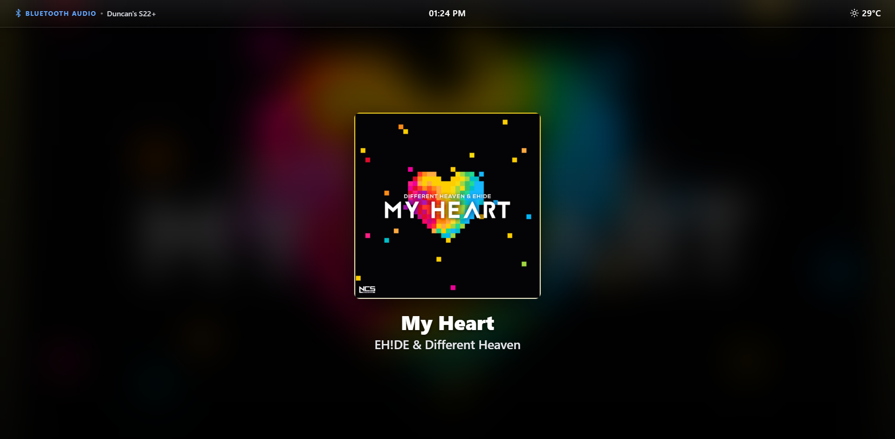

# Moode Audio Premium Bluetooth Dashboard

A responsive, high-end "frosted glass" Bluetooth dashboard for Moode Audio. Version 2.0 has been completely rewritten to natively integrate with Moode's internal backend, replacing the default Bluetooth placeholder screen with a premium, dashboard-style interface.

It silently listens to your Bluetooth streams in the background, fetches high-resolution album artwork using Moode's native caching tools, and dynamically injects a scalable layout featuring a live clock, dynamic weather, and your connected device name.




## 🌟 Features

* **Native Moode Integration:** Built specifically to Tim Curtis's architecture guidelines. It queries Moode's local SQLite cache (`moodeutl`) for instant rendering and gracefully falls back to Moode's native `radiocover_plus.py` utility for online artwork fetching.
* **Premium Dashboard UI:** Features a glassmorphism top bar with a live clock, dynamic day/night weather icon, and the active Bluetooth device name (e.g., "Duncan's S22+").
* **Legacy-Safe & Responsive:** Built with strict CSS Grid/Flexbox constraints to ensure it scales perfectly on modern smartphones, tablets, and older local Raspberry Pi Chromium displays without collapsing.
* **Thread-Safe & Robust:** Utilizes background threading to prevent D-Bus lockups, includes zombie-process hunters, and actively filters out dummy metadata (e.g., "Not Provided") sent by Android stacks.
* **Non-Destructive:** Leverages a custom JavaScript observer without ruining Moode's core templates.

## 🚀 How to Install

Run this single command in your Raspberry Pi's SSH terminal:

```bash
curl -sSL https://raw.githubusercontent.com/duncanmascarenhas/moode-bluetooth-overlay/main/install.sh | sudo bash

```

*(Note: If the `curl` command hangs due to Raspberry Pi IPv6/DNS blocking, use this `wget` alternative instead:)*

```bash
wget -4 -O install.sh https://raw.githubusercontent.com/duncanmascarenhas/moode-bluetooth-overlay/main/install.sh && sudo bash install.sh

```

**After installing, completely clear your phone or desktop web browser cache and skip a track over Bluetooth to wake the dashboard!**

## ⚠️ Disclaimer

* **Compatibility:** Tested on Moode Audio v10.3.4.
* This script edits your `/var/www/header.php` file to load the custom UI. While designed to be lightweight and safe, it is provided "as is" under the MIT license. Future Moode updates may overwrite `header.php`, requiring you to simply re-run the installer.

## Credits & License

Created by Duncan Mascarenhas | Nexus One Solutions
Released under the MIT License.
